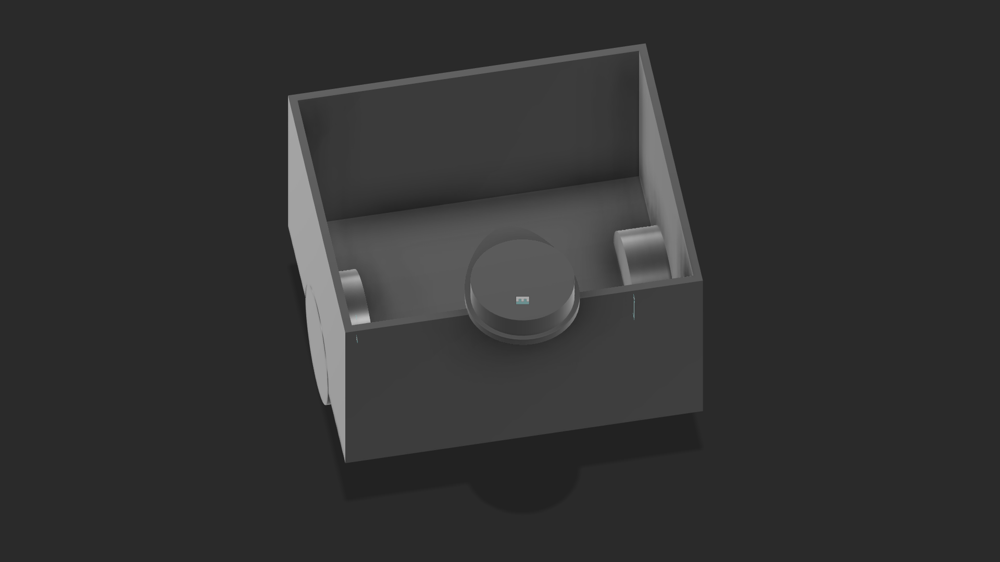

# servicebot — Robot Description



## Overview

| Property | Value |
|----------|-------|
| Total mass | 63.149 kg |
| Links | 4 |
| Joints | 3 (2 movable) |
| Assemblies | 1 |
| Root link | `base_link` |

## Table of Contents

- [Kinematic Tree](#kinematic-tree)
- [Link Properties](#link-properties)
- [Joint Properties](#joint-properties)
- [Assembly Breakdown](#assembly-breakdown)
- [Quick Start (ROS 2)](#quick-start-ros-2)
- [Files](#files)

## Kinematic Tree

```
base_link
  └─ Revolute_1 [continuous]
    servicebot_wheels
  └─ Revolute_2 [continuous]
    servicebot_wheels_2
  └─ Rigid_3 [fixed]
    lidar
```

## Link Properties

| Link | Mass (kg) | Material | Collision | Bodies |
|------|-----------|----------|-----------|--------|
| `base_link` | 44.7538 | Steel | box | 1 |
| `lidar` | 4.5230 | Steel | box | 1 |
| `servicebot_wheels` | 6.9360 | Steel | cylinder | 1 |
| `servicebot_wheels_2` | 6.9360 | Steel | cylinder | 1 |

## Joint Properties

| Joint | Type | Parent → Child | Axis | Limits |
|-------|------|---------------|------|--------|
| `Revolute_1` | continuous | `base_link` → `servicebot_wheels` | (-0,1,-0) | — |
| `Revolute_2` | continuous | `base_link` → `servicebot_wheels_2` | (-0,1,0) | — |
| `Rigid_3` | fixed | `base_link` → `lidar` | (0,0,1) | — |

## Assembly Breakdown

### servicebot

- **Links**: lidar, servicebot_wheels, servicebot_wheels_2, base_link
- **Total mass**: 63.149 kg

## Quick Start (ROS 2)

```bash
# 1. Copy package to your ROS 2 workspace
cp -r servicebot_description ~/ros2_ws/src/

# 2. Build
cd ~/ros2_ws
colcon build --packages-select servicebot_description
source install/setup.bash

# 3. Visualize in RViz2
ros2 launch servicebot_description display.launch.py

# 4. Validate URDF structure
check_urdf install/servicebot_description/share/servicebot_description/urdf/servicebot.urdf

# 5. Print kinematic tree
urdf_to_graphviz install/servicebot_description/share/servicebot_description/urdf/servicebot.urdf
```

**Joint control**: The launch file includes `joint_state_publisher_gui` —
use the sliders to move revolute/prismatic joints in RViz2.

**Topic inspection**:
```bash
# See published joint states
ros2 topic echo /joint_states

# See robot description parameter
ros2 param get /robot_state_publisher robot_description
```

## Files

| Path | Description |
|------|-------------|
| `urdf/servicebot.urdf.xacro` | Top-level xacro (entry point) |
| `urdf/servicebot.urdf` | Flat URDF (for validation) |
| `urdf/assemblies/` | Per-assembly xacro macros |
| `meshes/` | Visual (OBJ) and collision (STL) meshes |
| `launch/display.launch.py` | Launch robot_state_publisher, RViz, and generated controllers |
| `config/joint_state.yaml` | Joint state publisher config |
| `config/ros2_controllers.yaml` | Generated ros2_control controller manager config |
| `robot_data.yaml` | Supplementary data (beyond URDF) |
| `docs/transforms.md` | Transformation matrices (KaTeX) |

## Customizing

Assemblies tagged `!dummy_` are designed to be swapped out. To replace one:

1. Create your replacement as a xacro macro with the same interface
2. Place it in `urdf/assemblies/`
3. Update the `<xacro:include>` in `urdf/servicebot.urdf.xacro`
4. Update meshes in `meshes/<your_assembly>/`

The xacro prefix system (`${prefix}`) ensures link names stay unique
when multiple instances of the same assembly are used.

---
*Generated by Fusion URDF/XACRO Exporter v3.0.0*